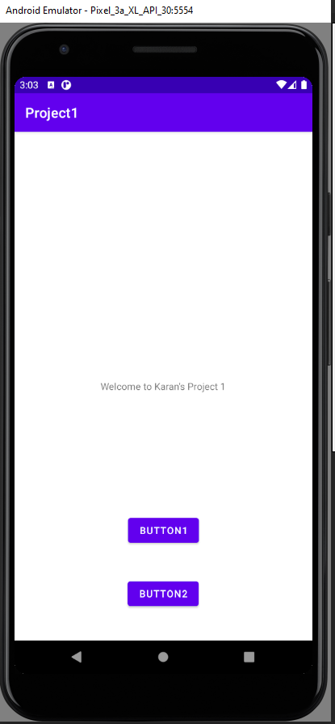
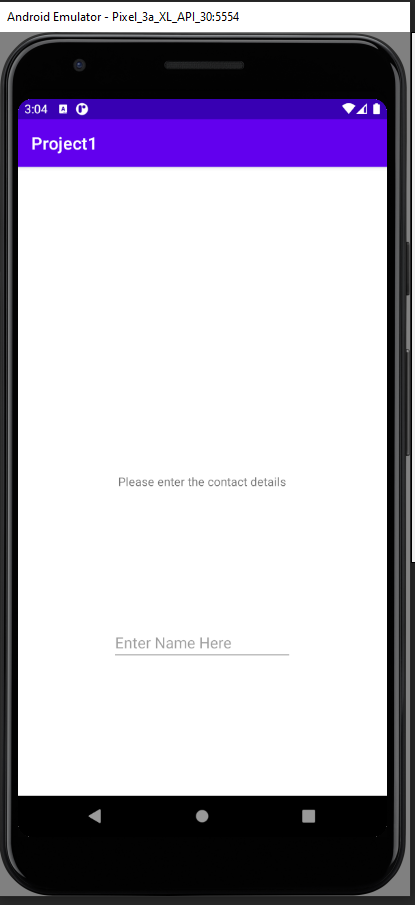
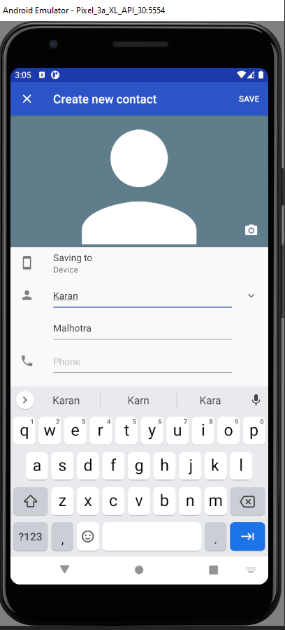
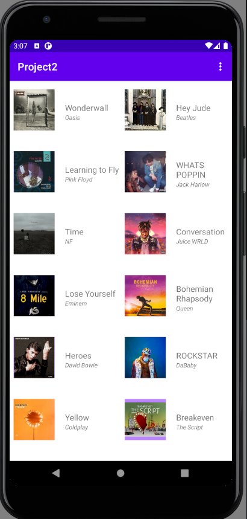
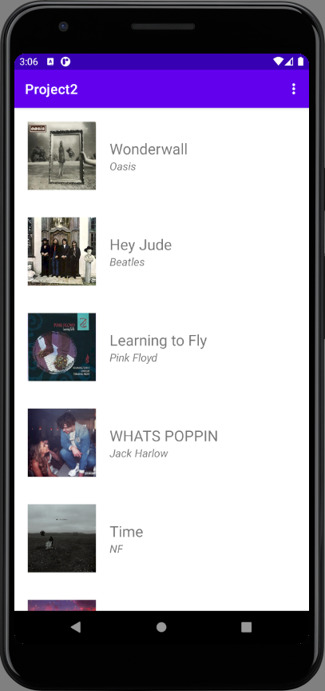
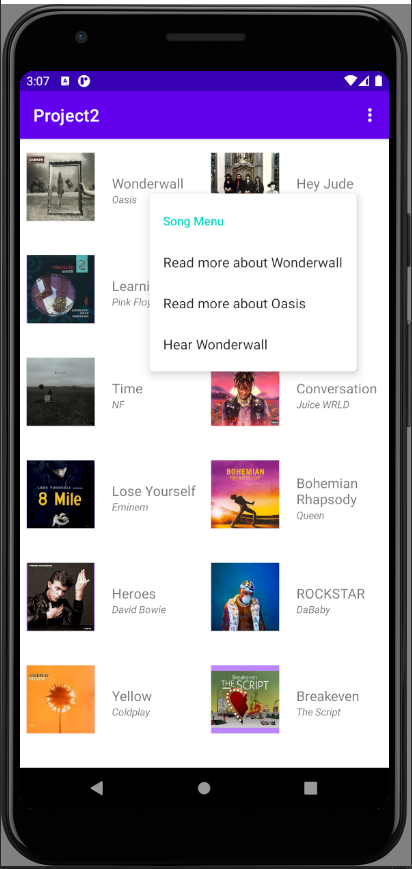

# Android-Projects

Contains source code and documentation of Android Projects made during the learning of CS-478, Mobile App Development course at University of Illinois at Chicago.

## Project 1

## Specification
- Android 11 - API Level 30

## Functionality
- The app displays 2 buttons and a welcome text
- On pressing the button 1, the user will be prompted to enter a legal name(consists of a name and a surname)
- After entering the name, the user is prompted back to the home screen.
- On pressing the button 2, if the name is a legal name, edit contacts is opened, else, a toast message is displayed stating that the name entered was not valid.

## App Screenshots

<table>
    <tr>
        <td>
            
        </td>
    </tr>
    <tr>
        <td>
            
        </td>
    </tr>
    <tr>
        <td>
            
        </td>
        <td>
            
        </td>
    </tr>
</table>

## Project 2

## Specification
- Android 11 - API Level 30

## Functionality
- The app select popular songs with a thumbnail, song title and artist name.
- Clicking on the song item will take the user to the song's YouTube page.
- User can switch between List and Grid view.
- Long clicking the song list item will open a popup menu and provides 3 choices to the user.
    1. Play Song.
    2. Open Artist Wiki.
    3. Open Song Wiki.

    Selecting the wiki pages will take the user to the respective wiki page on the mobile browser.

## App Screenshots

<table>
    <tr>
        <td>
            
        </td>
        <td>
            
        </td>
        <td>
            
        </td>
    </tr>
</table>
